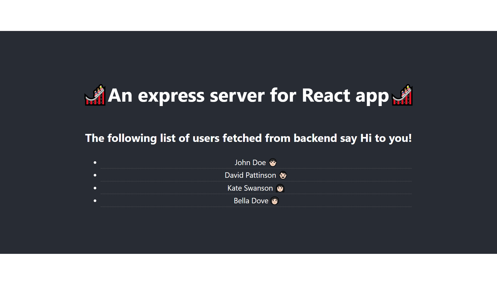

# A simple know-how project on how to integrate React.js with Express.js

This project helps in easy understanding of linking Express.js as a backend server to run your React application.

## Steps to run this project

Clone or download this repo to your local.

Under the path of react-with-express, run the following:

```html
npm install

npm run client-install

npm run dev
```

The final application runs on port 3000 and the backend server runs on port 5000.

Once you are successfully able to run the application you will see something like this:


## Encountered an issue ?

When developing a similar project, if you are facing any issue of data not fetched from backend, and the requests are going to the port 3000 only, you can

- clear your cache
- delete the package-lock.json (from client)
- delete node_modules (from client)
- npm install (at client)
- restart the server

## Credit

Thanks to [Brad Traversy](https://github.com/bradtraversy/react_express_starter) for giving insight into this realm of React.

## License

This project is licensed under the MIT License.
